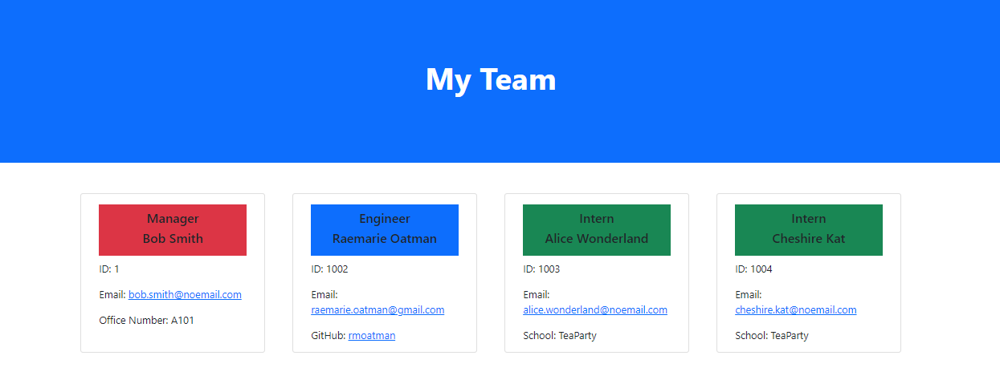

# Team Profile Generator

  

## Description

This app is a Node.js command-line application that takes in information about employees on a team, then generates a webpage that displays summaries for each person.

The webpage allows for easy access to team members' email addresses and github profiles.  Each team consists of one Manager and an unlimited amount of Engineers and Interns.  

A sample Team website generated by the app can be found here: [index.html](./Sample/index.html)
  

## Table of Contents

- [Installation](#installation)
- [Usage](#usage)
- [License](#license)
- [Collaborators](#collaborators)
- [Tests](#tests)
- [Questions](#questions)
  

## Installation

This repository can be cloned by using the following command:
~~~
gh repo clone rmoatman/Team_Profile_Generator
~~~

Then, install the inquirer and jest dependencies using the command:
~~~
npm install
~~~
 

## Usage

To run the app, use the command:
~~~
node index.js
~~~
A demonstration video can be found here: https://drive.google.com/file/d/1JS-ggMSbJHEYY9PUEnPZ2OFo7XaNqxAw/view
  
## License

This work is covered under MIT License.  For more information, click on the license badge above.
  

## Collaborators

Please contact me using the information below for questions, comments, and suggestions.
  

## Tests

Testing can be completed by using the following command:
~~~
npm test
~~~
The tests validate the class and subclass relationships and their individual constructors.  A demonstration video can be found here:  https://drive.google.com/file/d/1Z2nr0ApR4An6aJ5uLv75YHHQn4tq8jwK/view
  

## Questions

Have a question or comment?  Please contact me at:
Raemarie Oatman
GitHub Profile: github.com/rmoatman
raemarie.oatman@gmail.com

